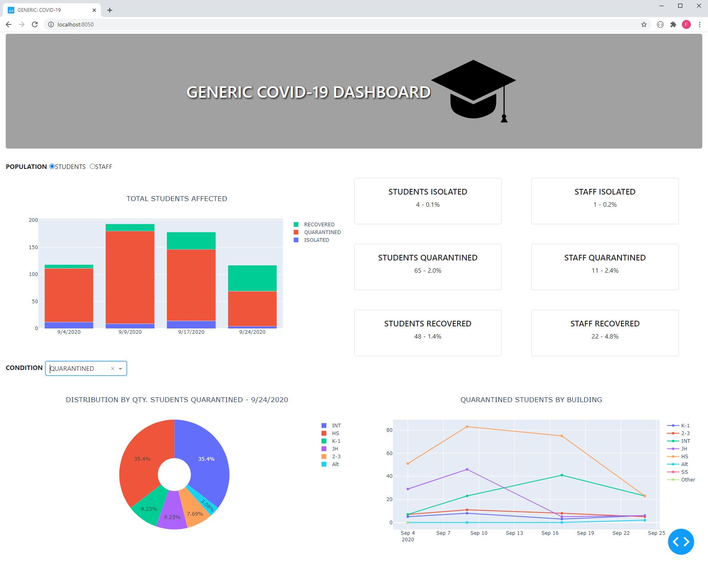

# School-COVID19-Dashboard
During the fall of 2020 many school districts are attempting to keep the public updated on COVID-19 cases within their student and staff populations.  Common modes of presentation of this data for SW Missouri schools include links to Google Sheets, static HTML pages, and links to Adobe *.pdf files.  These
modes of presentation are not interactive and typically only include data in a tabular form.  

This repository contains data inspired by a local SW Missouri school that is presented in the form of a a web-based interactive dashboard.  Software tools used
in the generation of the dashboard are listed below.

* [Plotly's Dash Framework](https://plotly.com/dash/)
* [Bootstrap Styling](https://getbootstrap.com/)

An example screenshot of the dashboard can be seen below.

